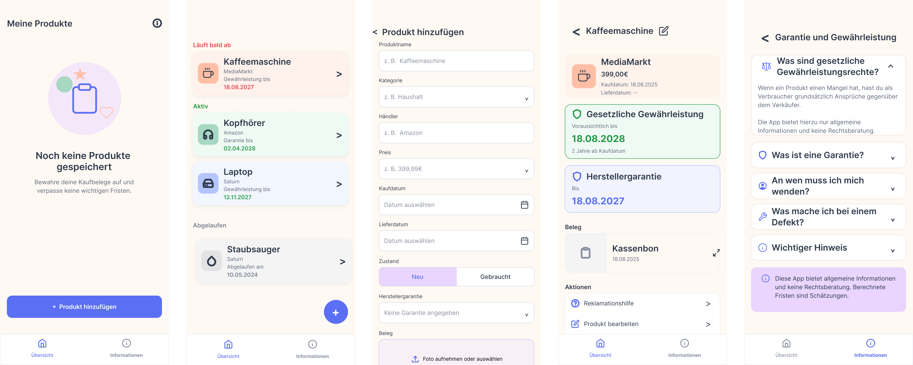

# warranty_tracker

Garantie-Tracker is a mobile application for managing product receipts, warranty periods, and important claim deadlines in one place.

The app is designed for consumers in Germany who want to keep track of their purchases and avoid losing warranty or statutory rights because a receipt is missing or a deadline has passed.

The MVP is built with a privacy-first approach: all data remains locally on the device. No account, cloud storage, or external server is required.

## Features

- Add and manage purchased products
- Store important product information:
  - Product name
  - Category
  - Purchase date
  - Purchase price
  - Retailer
  - Warranty duration
- Add receipt images using the camera or photo gallery
- Automatically calculate relevant warranty deadlines
- Track manufacturer warranty periods
- Track statutory consumer rights deadlines
- Display the current warranty status of each product
- Receive local reminders before a deadline expires
- Understand the difference between warranty and statutory rights
- Access a checklist for complaints, repairs, replacements, or refunds
- Store all data locally on the device

## Why Garantie-Tracker?

Receipts are often lost, warranty periods are forgotten, and many consumers are unsure whether they should contact the retailer or the manufacturer when a product becomes defective.

Garantie-Tracker provides a central overview of purchased products, receipts, and relevant deadlines. It helps users preserve their proof of purchase and take action before their rights expire.

## Privacy

Garantie-Tracker is designed as a local-first application.

- No user account
- No cloud synchronization
- No external database
- No personal data sent to a server
- Receipt images and product data remain on the device

This makes the MVP simple, private, and usable without an internet connection.

## Tech Stack

- **Flutter**
- **Dart**
- Local database and device storage
- Local file storage for receipt images
- Local notifications
- Feature-based project architecture

The user interface is written in German, while the source code, documentation, and development workflow are maintained in English.

## Planned User Flow

1. Add a new product.
2. Enter the purchase information.
3. Photograph or upload the receipt.
4. Select the applicable warranty duration.
5. View the calculated deadlines.
6. Receive reminders before a deadline expires.
7. Open the complaint checklist when a product becomes defective.

## Project Structure

```text
lib/
├── core/
│   ├── constants/
│   ├── services/
│   ├── theme/
│   └── utils/
├── features/
│   ├── products/
│   ├── receipts/
│   ├── reminders/
│   └── consumer_rights/
├── shared/
│   └── widgets/
└── main.dart
````

The exact structure may change as the application evolves.

## Getting Started

### Requirements

* Flutter SDK
* Dart SDK
* Android Studio or Xcode
* An Android emulator, iOS simulator, or physical device

### Installation

Clone the repository:

```bash
git clone https://github.com/YOUR-USERNAME/Garantie-Tracker.git
```

Open the project directory:

```bash
cd Garantie-Tracker
```

Install the dependencies:

```bash
flutter pub get
```

Run the application:

```bash
flutter run
```

## Development Status

Garantie-Tracker is currently under development.

The first version focuses on a small offline MVP that provides the essential functionality without accounts, servers, cloud storage, or OCR.

## MVP Scope

The initial MVP includes:

* Manual product creation
* Local product storage
* Receipt image storage
* Automatic deadline calculation
* Product and warranty status overview
* Local notifications
* Basic information about warranty and statutory consumer rights
* Complaint checklist

## Future Improvements

Possible future versions may include:

* Automatic receipt recognition using OCR
* Barcode scanning
* Receipt data extraction
* Product search and categorization
* Export and backup functionality
* Optional encrypted synchronization
* Shared household products
* Extended claim documentation
* Automatic document import
* Migration from other warranty or document-management tools

These features are not part of the initial offline MVP.

## Disclaimer

Garantie-Tracker provides general organizational information and does not constitute legal advice.

Warranty conditions may differ depending on the manufacturer, retailer, product, and individual purchase agreement. Users should verify relevant deadlines and conditions before making a legal claim.

## License

This project is currently intended for private development.

A software license may be added later.

```
```


## UI Design

The MVP interface was designed in Figma with a friendly, approachable and
privacy-focused visual style.



[View the complete design documentation](docs/design.md)
